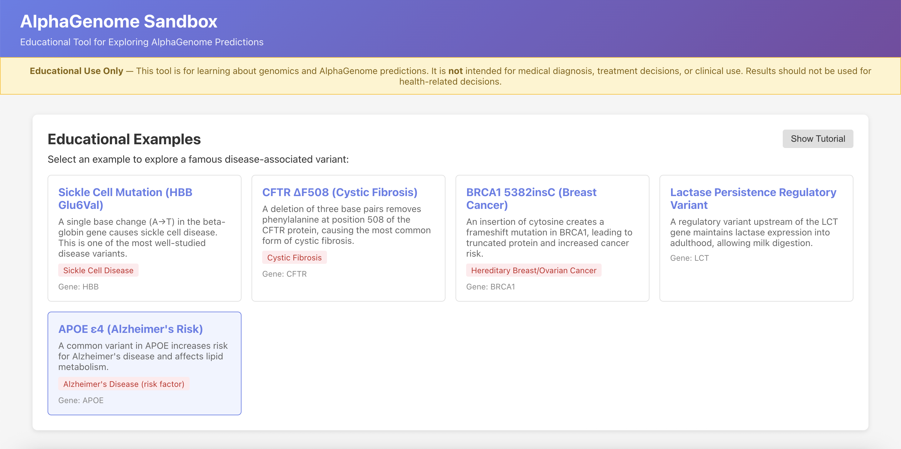
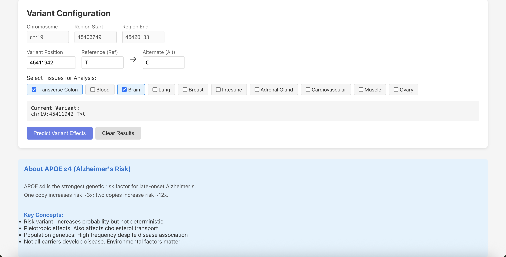
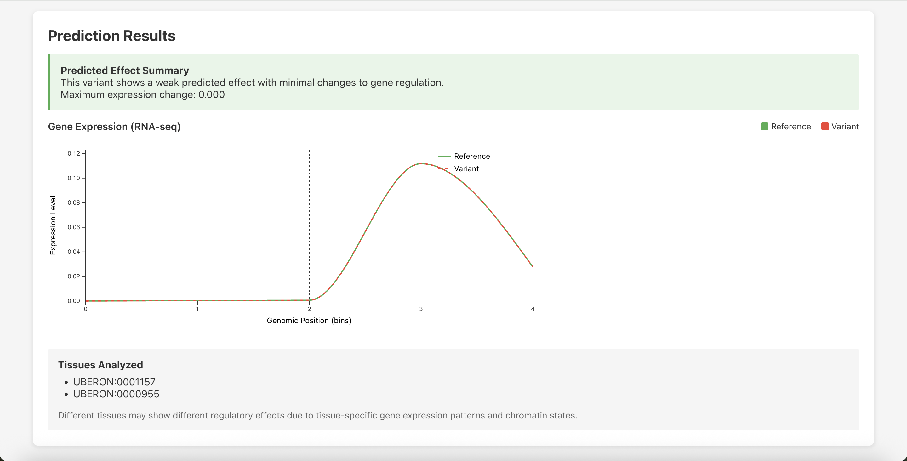

# AlphaGenome Sandbox

An educational tool for exploring how DNA variants affect gene regulation using Google DeepMind's AlphaGenome model.

**Educational use only** - Not for medical diagnosis. See [Terms of Use](TERMS_OF_USE.md) for details.

<div align="center">
  
  <p><em>Variety of examples that can be used in interactive walkthrough</em></p>
  
  
  <p><em>Configure variants and select tissues for analysis</em></p>
  
  
  <p><em>Visualize AlphaGenome predictions for gene expression changes</em></p>
</div>

## Overview

This tool allows you to:
- Explore well-known disease variants (sickle cell, cystic fibrosis, etc.)
- Visualize AlphaGenome predictions for gene expression and chromatin accessibility
- Compare effects across different tissues
- Learn about genomics concepts through interactive examples

## Setup

### Prerequisites

- Python 3.9+
- Node.js 18+
- AlphaGenome API key (free for non-commercial use at [deepmind.google.com/science/alphagenome](https://deepmind.google.com/science/alphagenome))

### Installation

```bash
# Backend
cd backend
python -m venv venv
source venv/bin/activate  # Windows: venv\Scripts\activate
pip install -r requirements.txt
cp .env.example .env
# Edit .env and add your ALPHAGENOME_API_KEY

# Frontend
cd ../frontend
npm install
```

### Running

```bash
# Terminal 1 - Backend
cd backend && python main.py

# Terminal 2 - Frontend
cd frontend && npm run dev
```

Then open http://localhost:5173

Or use the startup script:
```bash
./start.sh
```

## Project Structure

```
backend/           # FastAPI server
  ├── routers/     # API endpoints
  ├── models/      # Data schemas
  └── utils/       # Caching & API client

frontend/          # React + TypeScript
  └── src/
      ├── components/  # UI components
      ├── types/       # TypeScript types
      └── utils/       # API client
```

## Features

- **Educational Examples**: 5 famous disease variants with detailed explanations
- **Interactive Predictions**: Select variants and tissues to analyze
- **Visualizations**: D3.js charts showing gene expression and chromatin accessibility
- **Smart Caching**: SQLite cache to minimize API calls
- **Rate Limiting**: Respects AlphaGenome usage limits

## Examples Included

1. **Sickle Cell Mutation (HBB)** - Missense mutation and heterozygote advantage
2. **CFTR ΔF508** - In-frame deletion causing protein misfolding
3. **BRCA1 5382insC** - Frameshift mutation in tumor suppressor
4. **Lactase Persistence** - Regulatory variant and evolutionary adaptation
5. **APOE ε4** - Risk variant for Alzheimer's disease

## Citation

If using AlphaGenome in research:

```
Avsec Ž, Latysheva N, Cheng J, et al. (2026) 
Advancing regulatory variant effect prediction with AlphaGenome. 
Nature. doi:10.1038/s41586-025-10014-0
```

## Legal

- This tool uses AlphaGenome under non-commercial terms
- Results are predictive and should be validated experimentally
- Not for medical diagnosis or treatment decisions
- See [Terms of Use](TERMS_OF_USE.md) for complete details

## License

MIT License
